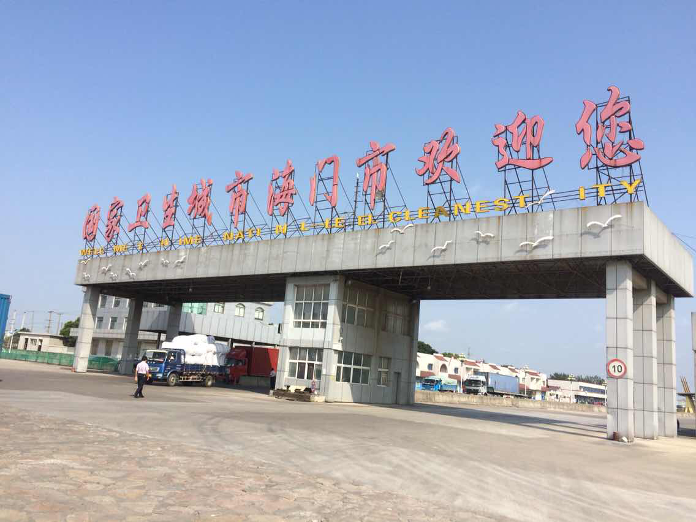

Title:2014-09-28 骑行回家第二天 过江
Date: 2014-09-28 18:51
Category: 随记
Tags: 随记,微信
Authors: liuwei

早上收拾好行李，在前面的沙溪镇吃了碗菠菜肉丝面，之后一路奔向太海汽渡过江，一切都很顺利，但到了海门没骑多久，右边的膝盖开始隐隐作痛，我也没太在意，继续赶路，但在通州大桥附近实在坚持不住了，我很奇怪这膝盖从未这般疼过，难道是昨晚膝盖受凉了?这突如其来的意外完全打乱了我的计划，我忍受着疼痛骑到了兴仁镇找到了一家宾馆住了下来，打算休息一天，希望明天膝盖能好起来，能够让我继续赶路!

