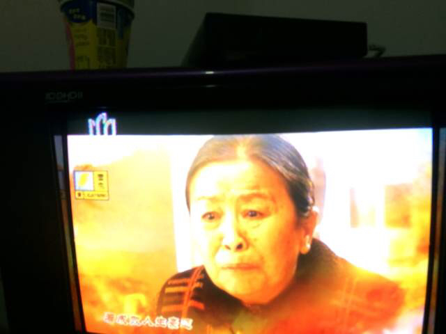
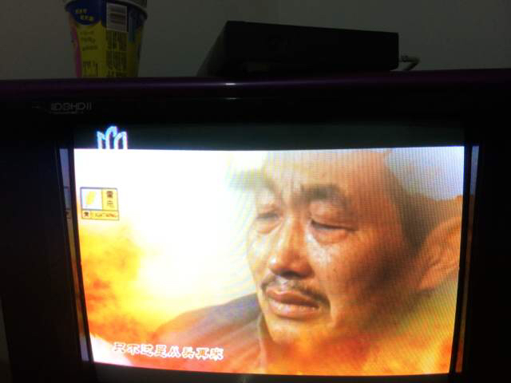

Title:电视剧老余家的孽债观后感
Date: 2014-09-12 10:40
Category: 随记
Tags: 随记, 微信
Authors: liuwei

电视剧《老余家的孽债》全剧终了，剧情依然很狗血，但是看完之后，心还是暖暖的，王建平最终对老婆孩子家庭亲人朋友有了担当，从立秋身上告诉我一个女人一定要自立自强乐观善良，这也是以后教育女儿的方向，包括志刚大叔，与子女关系像兄弟姐妹一样，很有亲和力，赞，评8.5分！

